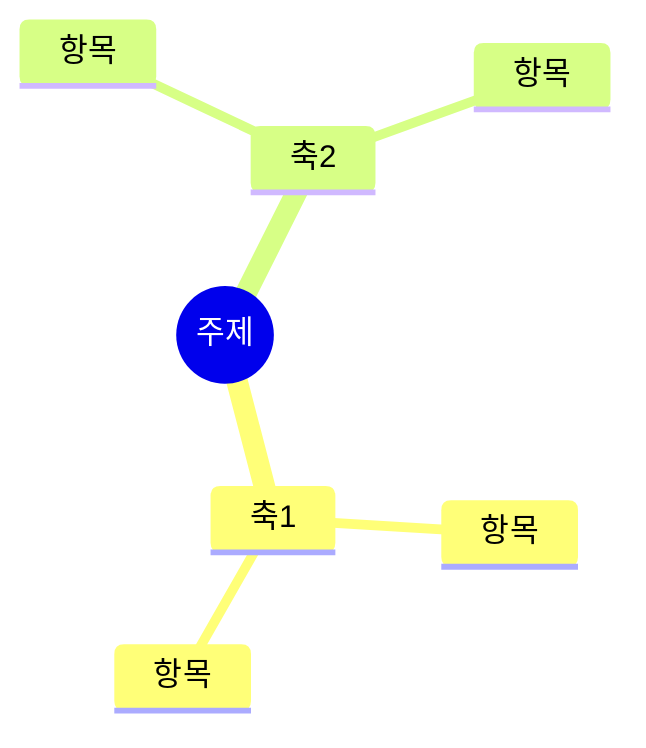

목적은 넓히는 것이 아니라 **연결하는 것**이다. 항목을 많이 나열하는 일은 모델이 이미 잘한다. 약한 것은 서로 다른 갈래를 맞붙여 원래 목록에 없던 것을 만들어 내는 일이다. 이 절차는 그 지점만 강제한다.

네 단계를 순서대로 밟는다. 단계를 건너뛰면 결과가 평범한 목록으로 돌아간다.

## 1. 축을 먼저 나눈다

후보를 하나도 적기 전에 주제를 **직교하는 축**으로 가른다. 축은 보통 3~5개다.

축이 제대로 갈렸는지 판정하는 기준은 하나다. **한 축의 두 항목이 동시에 성립할 수 없어야 같은 축이다.** 동시에 성립할 수 있으면 서로 다른 축에 있어야 한다. 예를 들어 "무료"와 "구독"은 같은 축(과금 방식)이고, "무료"와 "기업 대상"은 다른 축(과금 방식 · 대상 고객)이다.

축 이름은 명사구로 적는다. 축을 다 적은 뒤, 빠진 축이 없는지 한 번 되묻는다. 흔히 빠지는 축은 시간(언제), 주체(누가), 제약(무엇이 막는가)이다.

## 2. 축마다 벌린다

각 축에서 후보를 **최소 4개** 적는다. 3개에서 멈추면 뻔한 것 셋으로 끝난다.

각 축의 마지막 하나는 **일부러 극단이나 반대를 넣는다**. "아무도 안 하는 방식", "정반대로 하면", "그 축을 아예 없애면"에 해당하는 항목이다. 3단계의 교차 연결에서 쓸모 있는 조합은 대부분 이 극단 항목에서 나온다.

이 단계까지는 판단하지 않는다. 좋고 나쁨을 따지면 벌리기가 멈춘다.

## 3. 교차 연결한다 — 이 단계가 핵심이다

서로 **다른 축**의 항목을 둘씩 맞붙인다. 같은 축 안에서 묶는 것은 연결이 아니라 분류다.

연결은 최소 6쌍을 만들되, 각 쌍마다 **작동 방식을 한 문장으로 적는다**. 두 단어를 나란히 놓는 것은 연결이 아니다.

- 연결이 아닌 것: "구독 + 기업 대상"
- 연결인 것: "기업이 좌석 수로 구독하면, 개인 사용자는 무료로 두고도 매출이 서는 구조가 된다"

작동 방식을 쓰지 못하는 쌍은 버린다. 쓰다 보면 세 번째 항목이 필요해지는 쌍이 나오는데, 그것이 대개 가장 쓸 만한 조합이다.

연결을 마친 뒤 **한 번 더 묻는다**. 이 조합들 중 둘을 다시 붙이면 무엇이 되는가. 2차 연결에서 원래 목록에 없던 것이 나온다.

## 4. 쳐낸다

기준을 **먼저 정하고** 그 다음에 자른다. 기준은 사용자의 목적에서 가져온다. 기준 없이 자르면 그냥 익숙한 것만 남는다.

각 조합에 대해 이렇게 묻는다. 이것이 참이려면 무엇이 사실이어야 하는가. 그 사실을 지금 확인할 수 있는가. 확인할 수 없다면 무엇을 해 보면 알 수 있는가.

살아남은 것은 3개 안쪽으로 줄인다. 쳐낸 것 중 아깝게 탈락한 하나는 이유와 함께 남긴다. 나중에 조건이 바뀌면 그것이 먼저 살아난다.

## 결과물

가지가 여섯을 넘으면 mermaid 로 그린다. 그 아래에 살아남은 조합을 작동 방식과 함께 적고, 마지막에 다음 한 걸음을 한 줄로 놓는다.

교차 연결은 mindmap 문법으로 표현되지 않으므로 그림 아래 별도로 적는다. 연결이 그림보다 중요하다.

## 하지 말 것

- 축을 나누지 않고 바로 항목을 나열하는 것. 이 절차의 값이 전부 사라진다.
- 축마다 3개에서 멈추는 것. 넷째부터 익숙하지 않은 것이 나온다.
- 작동 방식 없이 단어만 붙이는 것. 연결한 척하는 나열이다.
- 기준 없이 "이게 제일 좋아 보인다"로 자르는 것.
- 사용자가 이미 정한 방향을 다시 벌리는 것. 결정된 축은 고정하고 나머지만 벌린다.
