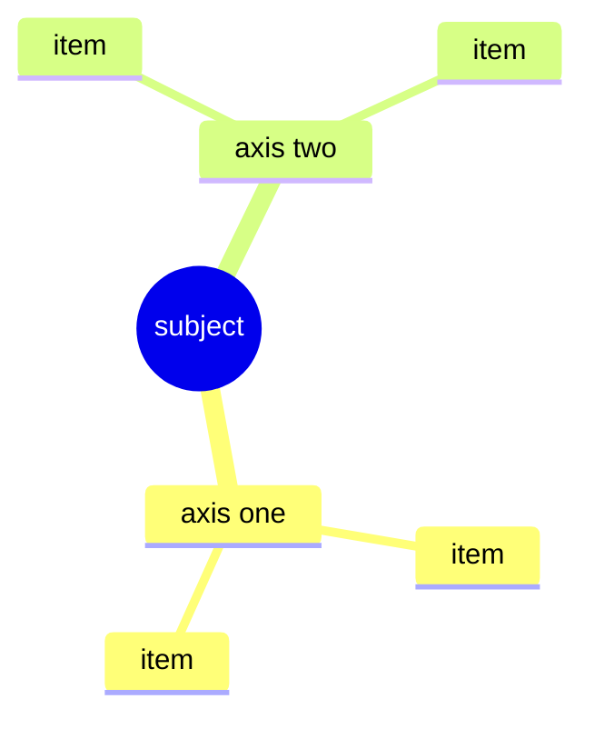

The point is not to widen. It is to **connect**. Producing many items is something a model already does well. What it does badly is putting two branches together and getting something that was on neither list. This procedure constrains that one step.

Work through four stages in order. Skipping one collapses the result back into an ordinary list.

## 1. Split into axes first

Before writing a single candidate, break the subject into **orthogonal axes**. Usually three to five.

One test decides whether the split is right: **two items belong to the same axis only if they cannot both be true at once.** If they can co-occur, they belong to different axes. "Free" and "subscription" are one axis (pricing model). "Free" and "sold to enterprises" are two (pricing model, buyer).

Name each axis as a noun phrase. When the axes are down, ask once what is missing. The three most often forgotten are time (when), actor (who), and constraint (what blocks this).

## 2. Spread each axis

Write **at least four** candidates per axis. Stopping at three leaves you with the three obvious ones.

Make the last item on each axis a **deliberate extreme or inversion**: the thing nobody does, the opposite choice, or removing that axis altogether. Most of the combinations worth having in stage 3 come out of these.

Do not judge yet. Evaluating while spreading stops the spread.

## 3. Cross-link — this is the stage that matters

Pair items from **different** axes. Grouping within one axis is classification, not connection.

Make at least six pairs, and for each one **write the mechanism in a sentence**. Two words side by side is not a connection.

- Not a connection: "subscription + enterprise"
- A connection: "if enterprises pay per seat, individual users can stay free and the revenue still stands up"

Discard any pair whose mechanism you cannot write. Some pairs will turn out to need a third element to work — those are usually the valuable ones.

When the pairs are down, **ask once more**: what happens if two of these combinations are joined? Second-order links are where something genuinely absent from the original lists shows up.

## 4. Prune

Fix the criterion **before** cutting, and take it from the user's actual goal. Cutting without a stated criterion just keeps whatever is most familiar.

For each surviving combination, ask what would have to be true for it to work, whether that can be checked now, and what small test would settle it if not.

Cut down to three or fewer. Keep the one that lost narrowly, with the reason — when conditions change, that is the one that revives first.

## Output

Draw a mermaid mind map once there are more than six branches. Below it, list the surviving combinations with their mechanisms, and close with the single next step.

Mermaid's mindmap syntax cannot express the cross-links, so write them below the diagram. The links matter more than the picture.

## Do not

- Start listing items without splitting axes first. That discards the entire value of the procedure.
- Stop at three items per axis. The unfamiliar ones start at the fourth.
- Pair words without a mechanism. That is a list pretending to be a synthesis.
- Cut on "this one looks best" with no stated criterion.
- Re-open a direction the user has already decided. Fix the settled axes and spread only the rest.
